Домашнее задание к занятию 5 «Тестирование roles»

Подготовка к выполнению

1) Установка molecule:

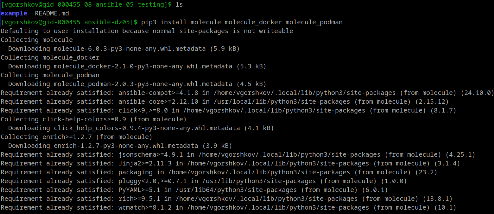
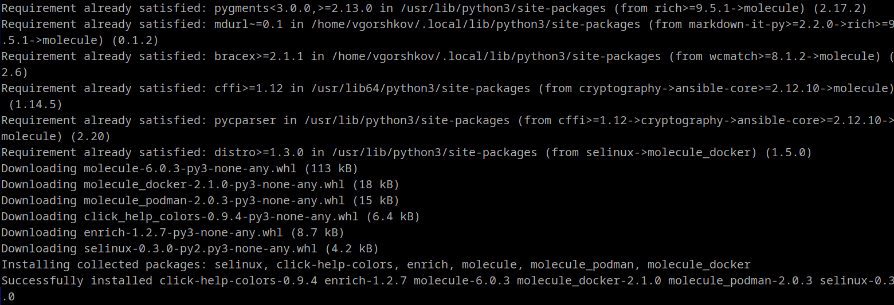

2) Установка podman, tox и несколькими пайтонами (3.7 и 3.9):
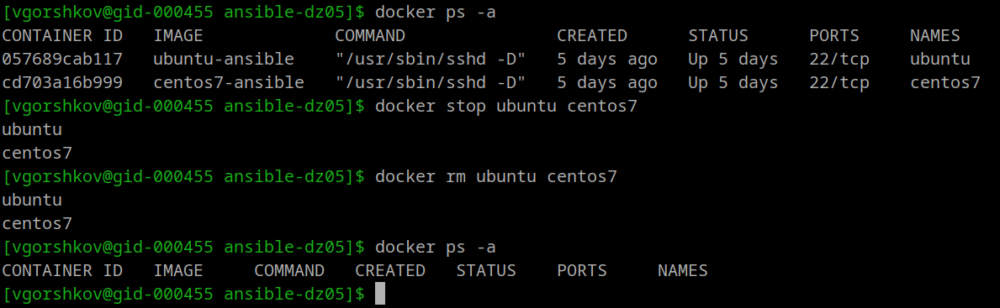
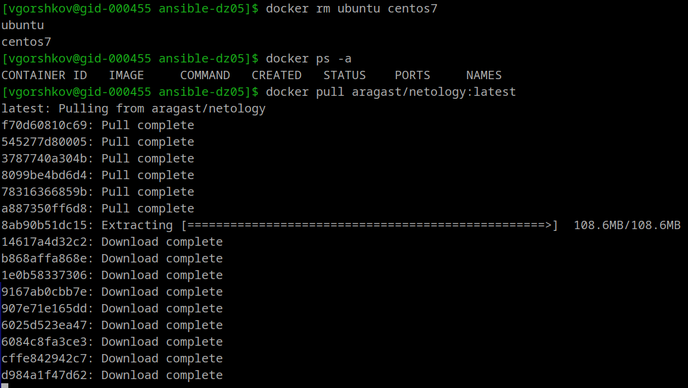
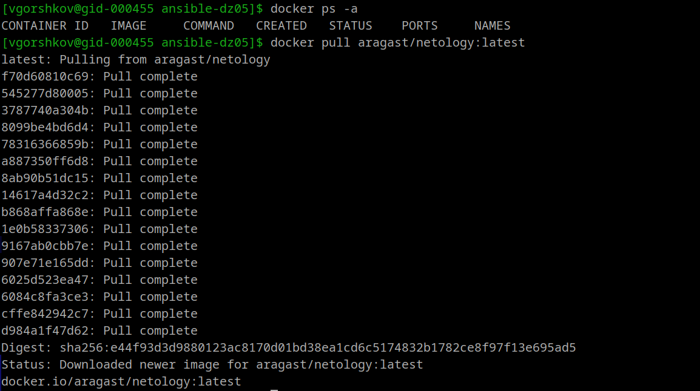

---=== Molecule ===---

molecule init scenario default --driver-name docker
default — имя нового сценария. Сценарий — это «набор инструкций», как тестировать роль.
--driver-name docker — говорит Molecule использовать Docker-контейнеры как виртуальные машины для тестирования.
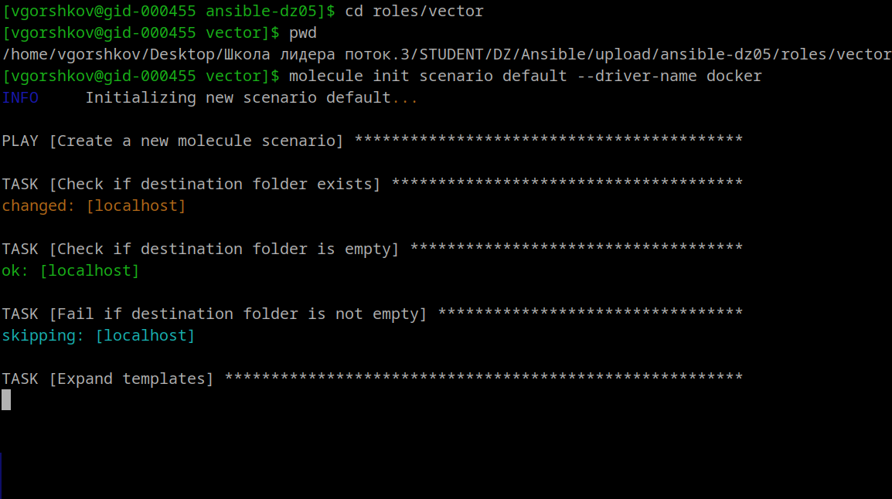
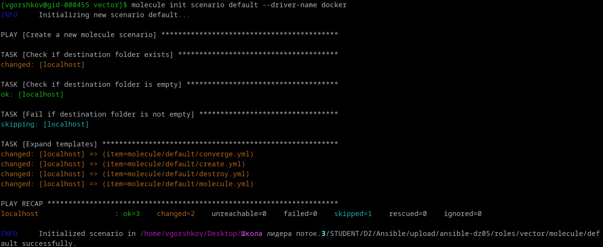

Смотрим структуру:

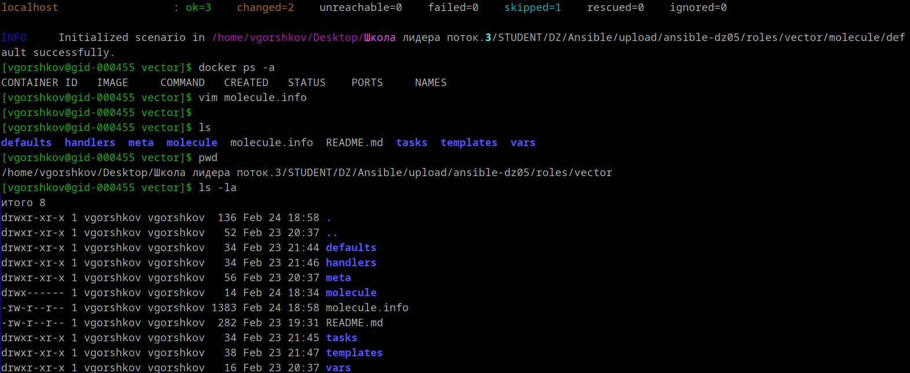

Выполняем:

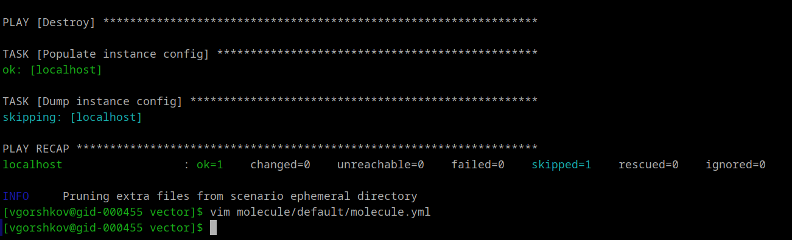

Вопрос 2:
Перейдите в каталог с ролью vector-role и создайте сценарий тестирования по умолчанию при помощи molecule init scenario --driver-name docker.

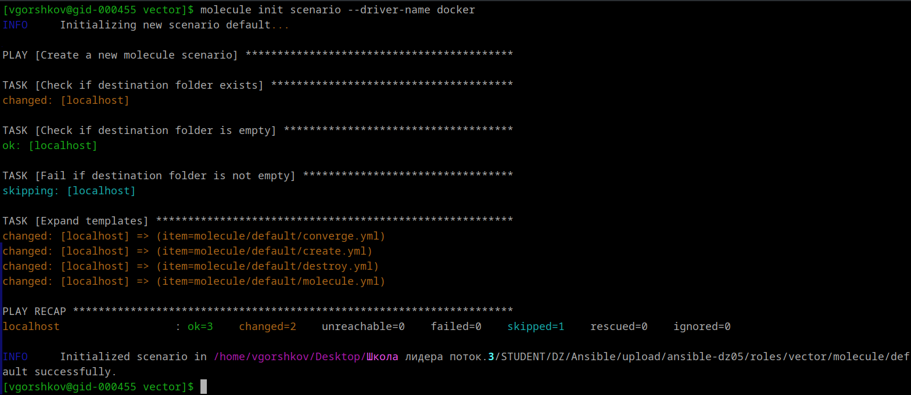
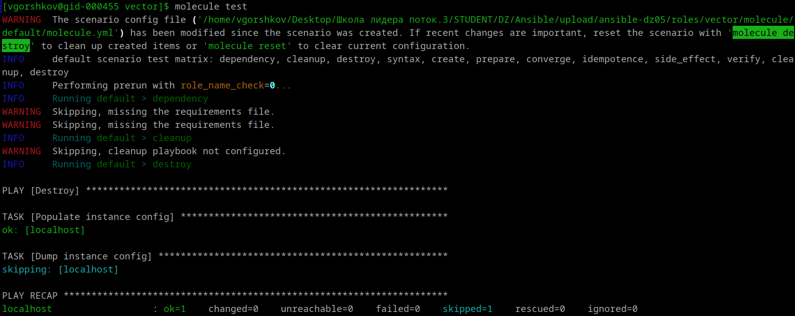
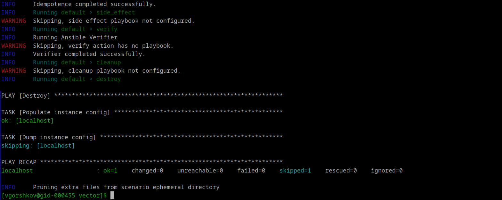

Тест пройден, преведущая конфигурация удалена через molecule destroy
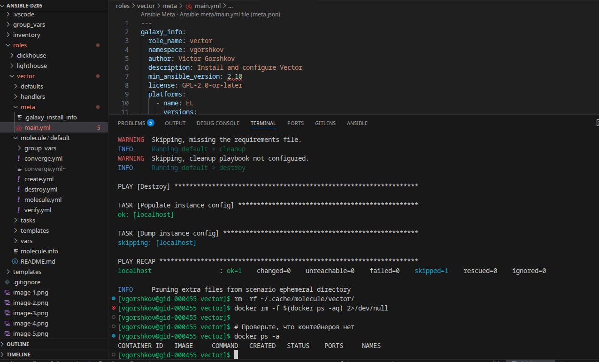

